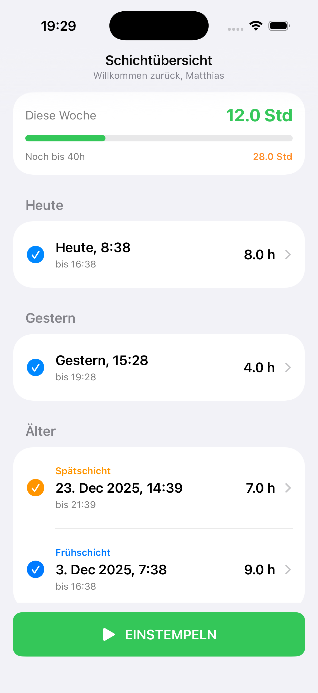
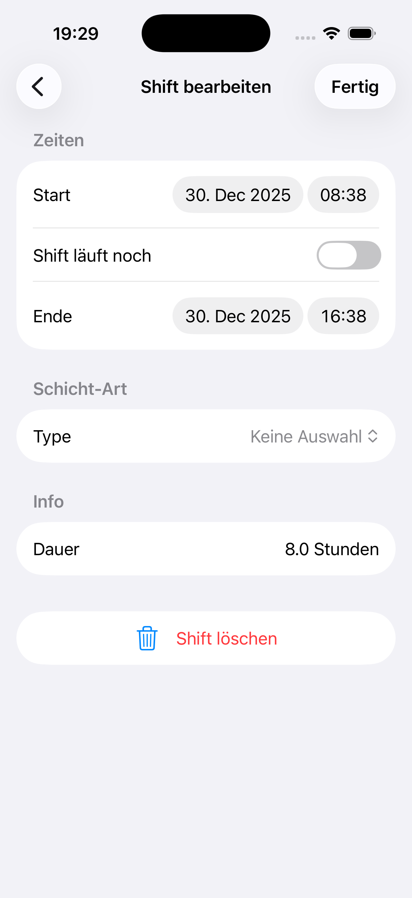
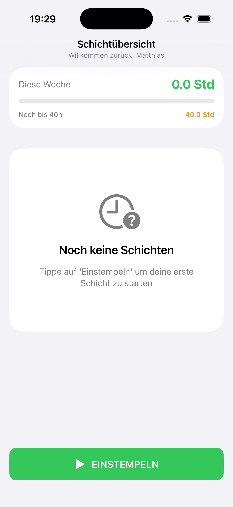

# ShiftTracker

> Moderne iOS-App für effizientes Schichtzeitmanagement

[Screenshot der Hauptansicht]

## 📱 Über ShiftTracker

ShiftTracker ist eine native iOS-App für Schichtarbeiter in Pflege, Gastronomie, Einzelhandel und anderen Branchen mit unregelmäßigen Arbeitszeiten. Die App hilft dabei, Arbeitsstunden präzise zu erfassen und Überstunden automatisch zu berechnen.

Entwickelt mit SwiftUI und SwiftData für eine moderne, performante User Experience.

## ✨ Features

- **Ein-Tap Zeiterfassung** - Großer Action-Button für schnelles Ein-/Ausstempeln
- **Wochenstatistik** - Automatische Berechnung von Arbeitsstunden und Überstunden (Montag-Samstag)
- **Schichttypen** - Farbcodierung für Früh-, Spät- und Nachtschichten
- **Intelligente Gruppierung** - Übersichtliche Darstellung nach Heute, Gestern, Diese Woche
- **Vollständige Bearbeitung** - Detail-View für Anpassung von Zeiten und Schichttypen
- **Live-Updates** - Echtzeit-Anzeige laufender Schichten

## 🛠 Technische Details

**Framework & Tools:**
- SwiftUI für deklaratives UI
- SwiftData für lokale Persistenz
- SF Symbols für konsistente Iconographie
- MVVM Architektur

**Anforderungen:**
- iOS 17.0+
- Xcode 15.0+

**Highlights:**
- Native Performance durch SwiftUI
- Bidirektionale SwiftData Relationships
- Optimierte State Management mit @Query und @Bindable
- Responsive Layout für alle iPhone-Größen

## 📸 Screenshots

   
   
   

## 🚀 Installation
```bash
git clone https://github.com/[dein-username]/ShiftTracker.git
cd ShiftTracker
open ShiftTracker.xcodeproj
```

Build und Run in Xcode (⌘R)

## 📄 Lizenz

MIT License

---

**Entwickelt von Matthias Böhnke**
```
